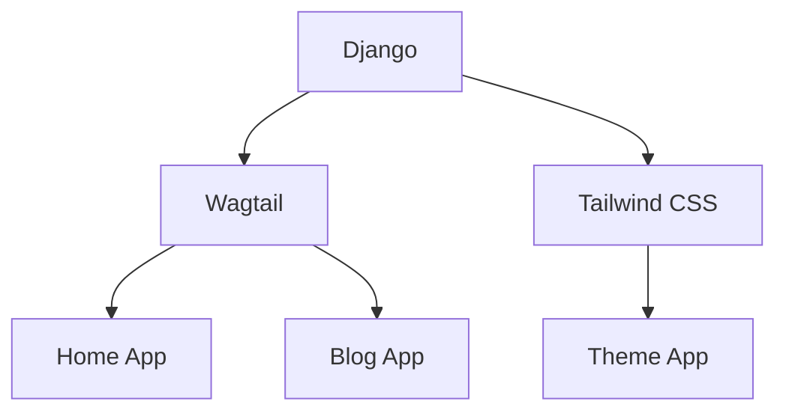

# Wagtail-Tailwind Blog

<div class="text-xl text-grey-600 mt-4 shadow-md">
Building lightning-fast ⚡️, beautiful blogs in record time!
</div>
<!-- TODO: Add "Speed" meme/GIF - search "fastest website meme" -->

<div class="text-xl text-blue-400 mt-4">
  "Because life's too short for slow, ugly websites"
</div>

<div class="abs-br m-6 flex gap-2">
  <a href="https://wagtail.org" target="_blank" class="text-xl icon-btn opacity-50 !border-none !hover:text-white">
    <!-- <logos:wagtail /> -->
    Wagtail
  </a>
  +
  <a href="https://tailwindcss.com" target="_blank" class="text-xl icon-btn opacity-50 !border-none !hover:text-white">
    <!-- <logos:tailwindcss-icon /> -->
    Tailwind
  </a>
</div>

---
layout: iframe-right
url: http://127.0.0.1:8000/
---

# Live Demo

<div class="text-lg text-green-500 mb-4">
  Here's what we'll build today
</div>

<div class="text-sm text-gray-500 mt-2">
  30-second preview of our finished blog
</div>

---
layout: two-cols
---

# What You'll Learn

<div class="grid grid-cols-2 gap-6 mt-8">
  <div class="flex items-center space-x-4">
    <div class="text-3xl">🏗️</div>
    <div>
      <div class="font-bold">Project Setup</div>
      <div class="text-sm text-gray-600">Django & Wagtail foundations</div>
    </div>
  </div>
  
  <div class="flex items-center space-x-4">
    <div class="text-3xl">🎨</div>
    <div>
      <div class="font-bold">Modern Styling</div>
      <div class="text-sm text-gray-600">Tailwind CSS basics</div>
    </div>
  </div>
  
  <div class="flex items-center space-x-4">
    <div class="text-3xl">📝</div>
    <div>
      <div class="font-bold">Content Modeling</div>
      <div class="text-sm text-gray-600">Blog structure & relations</div>
    </div>
  </div>
  <!--TODO: Consider whether we want deployment instructions in the presentation-->
  <div class="flex items-center space-x-4">
    <div class="text-3xl">🚀</div>
    <div>
      <div class="font-bold">Deployment</div>
      <div class="text-sm text-gray-600">Production-ready setup</div>
    </div>
  </div>
</div>

::right::

<div class="ml-4 mt-8">

### Your Takeaways

- Build a production-ready blog
- Master Wagtail CMS basics
- Learn modern CSS practices
- Implement responsive design
- Handle content relationships
<!--TODO: Consider whether we want deployment instructions in the presentation-->
- Deploy with confidence

<div class="mt-8 text-sm text-gray-500">
  Perfect for developers wanting to build content-rich sites quickly
</div>

</div>

---
layout: two-cols
---

# Technology Stack

<!-- TODO: Add "Dream Team" meme - search "perfect combination meme" -->

<div class="mt-12"></div>



::right::

<div class="ml-40 mt-30">


</div>

<!--
Our technology stack consists of:

- Django - The web framework providing our foundation
- Wagtail - A powerful, flexible CMS built on Django
- Tailwind CSS - A utility-first CSS framework
- django-tailwind - Package for seamless Tailwind integration

What we'll build:
- Home page with rich text content
- Blog with tagging functionality
- Responsive, modern UI with Tailwind
-->

---
transition: fade
---

# Project Setup

<div class="text-xl text-green-500 mb-4">
  Let's build something awesome! 🚀
</div>

<!-- TODO: Add "Building" GIF - search "building lego timelapse" -->

<div class="grid grid-cols-2 gap-4">

<div>

### Environment Setup

```bash
# Create and activate virtual environment
python -m venv venv
source venv/bin/activate
# or venv\Scripts\activate on Windows
```

### Installing Dependencies

```bash
# Install core packages
pip install django wagtail
```

### Project Creation

```bash
# Create a new Wagtail project
wagtail start myproject
cd myproject
```
We'll configure Django-Tailwind shortly...

</div>
<!--this basically creates a column break-->
<div>


### Database Setup

```bash
# Initialize database with superuser
python manage.py migrate
python manage.py createsuperuser
```

### Run the Project
Run these commands in separate terminals:
```bash
python manage.py runserver
```

</div>

</div>

<!--
Let's start by setting up our development environment:

1. We first create a virtual environment to isolate our dependencies
2. Then we install the core packages - Django, Wagtail, and django-tailwind
   - The [reload] option enables hot reloading during development
3. We create a new Wagtail project using the CLI tool
4. Initialize the database with migrations
5. Create an admin user to access the CMS
6. Start the development server to see our project

These steps give us a working foundation to build upon.
-->

---
---

# Tailwind Integration

### Installation Steps

```bash
# Initialize Tailwind in the project
python manage.py tailwind init

# Install Tailwind dependencies
python manage.py tailwind install
```

### Configuration - settings.py

```python
INSTALLED_APPS = [
    'tailwind',
    'theme',  # your newly created theme app
    'django_browser_reload',
]
TAILWIND_APP_NAME = 'theme'
INTERNAL_IPS = [
    "127.0.0.1",
]
MIDDLEWARE = [
    # ...existing middleware
    "django_browser_reload.middleware.BrowserReloadMiddleware",
]
```

---
---
# Tailwind Integration continued


### URL Configuration - urls.py

```python
from django.urls import include, path

urlpatterns = [
    # ...existing patterns
    path("__reload__/", include("django_browser_reload.urls")),
]
```

### Template Integration

Load Tailwind in the `myapp/templates/base.html`

```html

<head>
    <!-- other head elements -->
    
</head>
```


<!--
Tailwind integration requires several configuration steps, but the django-tailwind package makes it relatively straightforward.
The browser reload configuration enables hot reloading during development.
-->

---
transition: slide-up
layout: statement
---

# Styling: The Maintainability Challenge

<div class="text-lg text-amber-500 mb-4">
  Problem: How do we keep styles maintainable while supporting dark mode and responsive design?
</div>

<div class="text-lg text-green-600 mb-6">
  Solution: Tailwind's utility-first approach with component extraction
</div>

# Styling with Tailwind

<div class="text-md text-purple-400 mb-4">
  Making CSS fun again (while polluting our HTML)! 🎨
</div>

<!--
Tailwind makes styling straightforward with utility classes. The prose plugin is particularly useful for blog content.
Dark mode is handled with dark: prefixed classes, making theme implementation simpler.
-->

---
layout: section
---
# Building the project

---
layout: image-right
image: https://images.unsplash.com/photo-1517842645767-c639042777db?q=80&w=1770
---

# Project Structure

- **home/** - Home page app
  - `models.py` - Home page model
  - `templates/` - Home page templates
- **blog/** - Blog application
  - `models.py` - Blog models
  - `templates/` - Blog templates
- **theme/** - Tailwind app (generated)
  - `static/` - Compiled CSS
  - `templates/` - Base templates
- **myproject/** - Project settings
  - `settings/` - Configuration files
  - `urls.py` - URL routing

<!--
This is the high-level structure of our project. We'll explore each of these components in detail.
-->

---
---

# Home App: Models


```python {all|2-4|6-10|12|14}
# home/models.py
from django.db import models
from wagtail.models import Page
from wagtail.fields import RichTextField


class HomePage(Page):
    body = RichTextField(blank=True)

    content_panels = Page.content_panels + ["body"]

    max_count = 1

    subpage_types = ["blog.BlogIndexPage", "blog.TagsIndexPage"]
```


<!-- 
- Extends Wagtail's `Page` model
- `RichTextField` for content editing
- `max_count = 1` ensures only one home page
- `subpage_types` defines allowed child pages
-->

---
layout: two-cols
---

# Base Templates

<div>

```html {all|1|5-11|13-18}


<!DOCTYPE html>
<html lang="en">
<head>
    <meta charset="UTF-8">
    <meta name="viewport" content="width=device-width">
    <title>{{ page.title }}</title>
    
    
</head>
<body class="bg-white dark:bg-gray-900">
    <div class="container mx-auto px-4">
        
        <main class="py-8">
            
        </main>
    </div>
</body>
</html>
```

</div>

::right::

<div class="ml-4">

### Key Features

- **Template Tags**
  - `static` for assets
  - `tailwind_tags` for styles
- **Block System**
  - `title` - Page title
  - `content` - Main content
  - `extra_css` - Additional styles
- **Layout**
  - Responsive container
  - Dark mode support
  - Navigation include
  - Semantic HTML5

</div>

<!--
The base template provides the foundation for all pages.
Note how we use template inheritance and blocks for flexibility.
-->

---

# Blog Models: The Content Structure Challenge

<div class="text-lg text-amber-500 mb-4">
  Problem: How do we structure content to be both flexible for editors and maintainable for developers?
</div>

<div class="text-lg text-green-500 mb-6">
  Solution: Wagtail's StreamField and hierarchical page models
</div>

# Blog Models: BlogIndexPage

```python {all|3-4|7-13|15-17|19-21|all}
# blog/models.py

from django.db import models
from wagtail.models import Page
from wagtail.fields import RichTextField
from wagtail.admin.panels import FieldPanel

class BlogIndexPage(Page):
    intro = RichTextField(blank=True)
    
    content_panels = Page.content_panels + [
        FieldPanel('intro')
    ]
    
    # Only allow BlogPage children
    subpage_types = ['blog.BlogPage']
    
    # Get live blog posts ordered by date
    def get_posts(self):
        return BlogPage.objects.live().order_by('-date')
    
    # Make posts available to template
    def get_context(self, request, *args, **kwargs):
        context = super().get_context(request, *args, **kwargs)
        context['posts'] = self.get_posts()
        return context
```

<!--
The BlogIndexPage serves as a container and listing page for blog posts.
It demonstrates Wagtail's powerful context manipulation to provide data to templates.
-->

---
layout: two-cols
---

# Blog Models: BlogPage

```python {0|1-5|7-19|21-26|all}
# blog/models.py (continued)
class BlogPageTag(TaggedItemBase):
    content_object = ParentalKey(
        'BlogPage',
        related_name='tagged_items',
        on_delete=models.CASCADE
    )

class BlogPage(Page):
    date = models.DateField("Post date")
    intro = models.CharField(max_length=250)
    body = StreamField([
        ('heading', blocks.CharBlock(form_classname="title")),
        ('paragraph', blocks.RichTextBlock()),
        ('image', ImageChooserBlock()),
    ], use_json_field=True)
    tags = ClusterTaggableManager(through=BlogPageTag, blank=True)
    
    content_panels = Page.content_panels + [
        FieldPanel('date'),
        FieldPanel('intro'),
        FieldPanel('body'),
        FieldPanel('tags'),
    ]
```

::right::

<div class="mt-8 ml-4">

### Key Features

- `StreamField` for flexible content
  - Headings
  - Rich text paragraphs
  - Images
- Tags for categorization
  - `ClusterTaggableManager`
  - `BlogPageTag` model for relationship
- Admin panels for easy editing
- Date field for chronological ordering

### StreamField

Wagtail's StreamField provides a block-based content editing experience similar to Gutenberg in WordPress but more customizable.


</div>

<!--
The BlogPage model is more complex, featuring StreamField for flexible content and tagging functionality.
StreamField allows editors to build pages from predefined content blocks in any order they choose.
-->

---
layout: section
---
# Navigation component

Navigation is one of the most important aspects of the site.

---
---
# Navigation Component: Context

<div class="grid grid-cols-2 gap-4">

<div>

### Context Processor

```python {all|2-3|5-14|16-21}
# context_processors.py
from wagtail.models import Site
from blog.models import BlogIndexPage, TagsIndexPage

def navigation_pages(request):
    site = Site.find_for_request(request)
    homepage = site.root_page
    try:
        blogindex = BlogIndexPage.objects.live().first()
    except BlogIndexPage.DoesNotExist:
        blogindex = None
    try:
        tagsindex = TagsIndexPage.objects.live().first()
    except TagsIndexPage.DoesNotExist:
        tagsindex = None
    return {
        'navigation_homepage': homepage,
        'navigation_blogindex': blogindex,
        'navigation_tagsindex': tagsindex,
    }
```

</div>

<div>

### Configuration

```python
# settings.py
TEMPLATES = [
    {
        'BACKEND': 'django.template.backends.django.DjangoTemplates',
        'OPTIONS': {
            'context_processors': [
                # ...existing processors
                'app.core.context_processors.navigation_pages',
            ],
        },
    },
]
```

</div>

</div>

<!--
The context processor provides navigation pages to all templates.
It handles missing pages gracefully and uses Wagtail's site finder.
-->

---
---
# Navigation Menu: Template

<div class="text-lg text-orange-400 mb-4">
  Pro tip: Navigation is like a good joke - if you have to explain it, it's not that good! ⚡️
</div>

<!-- TODO: Add "Navigation" meme - search "website navigation maze meme" -->

```html {all|1|2-5|6-10|15|all}

<nav aria-label="Main navigation" class="bg-gray-800 shadow-lg">
    <div class="container mx-auto px-4">
        <div class="flex items-center justify-between h-16">
            <div class="flex-shrink-0">
                <a href="" 
                   class="text-xl font-bold text-white hover:text-blue-200 transition-colors"
                   aria-label="Home">
                    {{ request.site.site_name|default:"Home" }}
                </a>
            </div>
            
            <div class="hidden md:block">
                <ul class="flex space-x-8" role="menubar">
                    
                    <!-- Additional Nav Items -->
                </ul>
            </div>
        </div>
    </div>
</nav>
```

<!--
- Responsive design with mobile menu
- Dynamic navigation items from context
- Active state highlighting
- Dark mode support
- Accessible button for mobile menu
-->


---
---
# Navigation Component: Nav Item

```html {all|1|3-10|all}


<li role="none">
    <a href="" 
       role="menuitem"
       class="inline-flex items-center px-3 py-2 text-sm font-medium text-gray-300 hover:text-white hover:bg-gray-700 rounded-md transition-colors focus:outline-none focus:ring-2 focus:ring-offset-2 focus:ring-offset-gray-800 focus:ring-white"
       aria-current="page">
        {{ label }}
    </a>
</li>
```


---
layout: two-cols
---

# Wagtail Admin Interface

<div class="mt-4">


</div>

::right::

<div class="ml-8 mt-12">

### Key Features

- **Dashboard** - Quick access to content
- **Explorer** - Navigate page hierarchy
- **Images & Documents** - Media management
- **Reports** - Content insights
- **Settings** - Site configuration

<div class="mt-6">

### Page Creation Flow

1. Navigate to parent page
2. Click "Add child page"
3. Select page type
4. Create content using panels
5. Publish or save draft

</div>

</div>

<!--
The Wagtail admin interface provides a powerful yet user-friendly environment for content editors.
The page hierarchy is central to Wagtail's content organization system.
-->

---
layout: section
---

# Deployment & Next Steps

---

# Deployment: The Production Ready Challenge

<div class="text-lg text-amber-500 mb-4">
  Problem: Moving from development to a secure, performant production environment
</div>

<div class="text-lg text-green-500 mb-6">
  Solution: Production settings, environment variables, and proper server configuration
</div>

# Deployment Considerations

<div class="grid grid-cols-2 gap-8">

<div>

### Production Settings

```python
# settings/production.py

DEBUG = False

SECRET_KEY = os.environ.get('SECRET_KEY')

ALLOWED_HOSTS = [
    'yourdomain.com', 
    'www.yourdomain.com'
]

# Database configuration
DATABASES = {
    'default': {
        'ENGINE': 'django.db.backends.postgresql',
        'NAME': os.environ.get('DB_NAME'),
        'USER': os.environ.get('DB_USER'),
        # Other DB settings...
    }
}

# Static files
STATIC_ROOT = os.path.join(BASE_DIR, 'staticfiles')
MEDIA_ROOT = os.path.join(BASE_DIR, 'media')
```

</div>

<div>

### Deployment Options

- **Platform as a Service**
  - Heroku
  - PythonAnywhere
  - DigitalOcean App Platform

- **Virtual Private Server**
  - Nginx + Gunicorn
  - Docker containers
  - Traefik for routing

- **Static Site Generation**
  - For performance optimization
  - Consider Wagtail-based static site generators

</div>

</div>

<!--
When deploying, you'll need to consider various factors including database configuration, static files, and security settings.
There are multiple deployment options depending on your requirements and budget.
-->

---
layout: center
class: "text-center"
---

# Next Steps & Resources

<div class="text-xl text-green-500 mb-6">
  You're now equipped to build amazing blogs! 🎉
</div>

<!-- TODO: Add "Success" GIF - search "you got this celebration" -->

<div class="grid grid-cols-3 gap-8 mt-6">

<div>

### Enhancements

- Comments system
- Newsletter integration
- Social media sharing
- SEO optimization
- Analytics integration

</div>

<div>

### Learning Resources

- [Wagtail Documentation](https://docs.wagtail.org/)
- [Tailwind CSS Documentation](https://tailwindcss.com/docs)
- [Django Documentation](https://docs.djangoproject.com/)
- [Wagtail Community](https://github.com/wagtail/wagtail/wiki/Community)

</div>

<div>

### Tools & Packages

- [wagtail-markdown](https://github.com/torchbox/wagtail-markdown)
- [wagtail-factories](https://github.com/wagtail/wagtail-factories)
- [django-tailwind-cli](https://pypi.org/project/django-tailwind-cli/)
- [wagtail-2fa](https://github.com/labd/wagtail-2fa)

</div>

</div>

<div class="mt-12 text-gray-500">

Thank you! Questions?

</div>

<!--
This concludes our tutorial, but there are many ways to extend and enhance your Wagtail-Tailwind blog.
The resources listed will help you continue your learning journey.
-->
